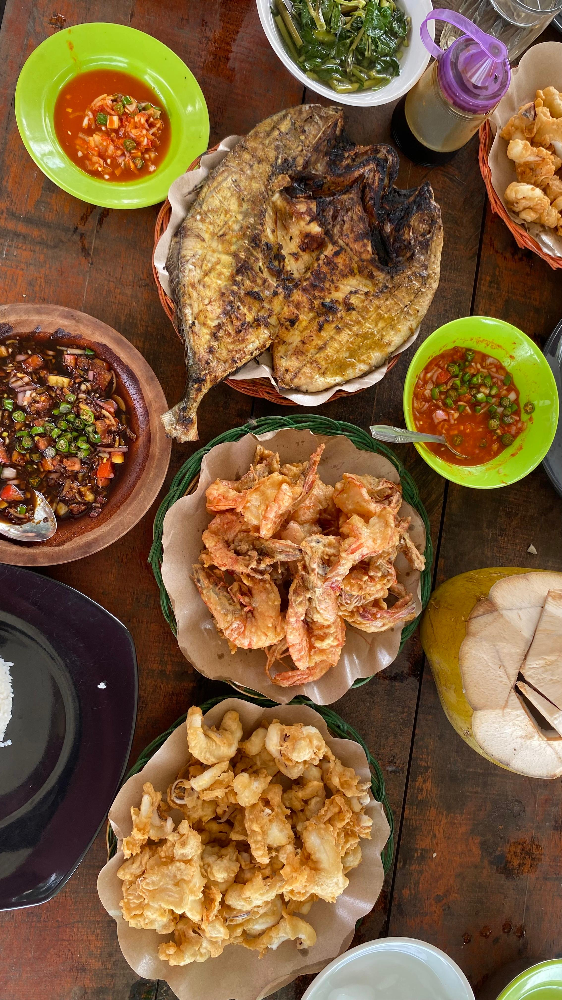
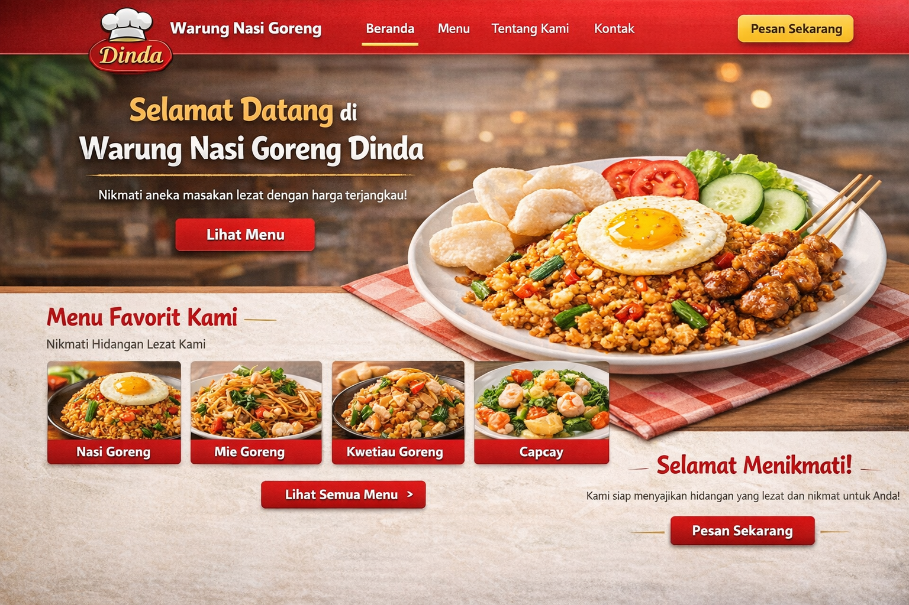

<!DOCTYPE html>
<html lang="id">
<head>
    <meta charset="UTF-8">
    <meta name="viewport" content="width=device-width, initial-scale=1.0">
    <title>Dinda Maulidya | Portfolio</title>

    <link href="https://fonts.googleapis.com/css2?family=Poppins:wght@300;400;600;700&display=swap" rel="stylesheet">

    <link rel="stylesheet" href="style.css">
</head>
<body>

<header class="navbar">
    <h1 class="logo">Dnd.id</h1>
    <nav>
        <ul class="nav-links">
            <li><a href="#home">Home</a></li>
            <li><a href="#about">About</a></li>
            <li><a href="#portfolio">Portofolio</a></li>
            <li><a href="#skills">Skills</a></li>
            <li><a href="#contact">Contact</a></li>
        </ul>
    </nav>
</header>

<section class="hero" id="home">
    

       

    <h1 class="typing delay">Halo, Saya Dinda Maulidya</h1>
    <h2>Mahasiswi Sistem Informasi</h2>
        

        

            

                
            

        

    

</section>

<section id="about" class="section">
    

        <h2 class="title">About Me</h2>

        

            
            

                <h3>Deskripsi Diri</h3>
                

                    Saya adalah mahasiswi Program Studi Sistem Informasi 
                    Universitas Muhammadiyah Sumatera Utara yang memiliki 
                    minat dalam pengembangan web dan sistem informasi. 
                    Saya memiliki sikap disiplin, bertanggung jawab, serta 
                    mampu bekerja secara individu maupun dalam tim.
                

            

            
            

                <h3>Pendidikan</h3>
                <ul class="edu-list">
                    <li>2010 - 2016 | SD Tamansiswa</li>
                    <li>2016 - 2019 | SMP Tamansiswa</li>
                    <li>2019 - 2022 | SMK Sandhy Putra 2 | Teknik Komputer dan Jaringan (TKJ)</li>
                    <li>2024 - Sekarang | S1 Sistem Informasi | Universitas Muhammadiyah Sumatera Utara</li>
                </ul>
            

        
            

                <h3>Hobi</h3>

                <ul class="hobby-list">
                    <li>Mendaki dan menikmati alam terbuka</li>
                    <li>Belajar hal baru yang bermanfaat</li>
                    <li>Hunting dan eksplorasi kuliner</li>
                    <li>Traveling untuk menambah wawasan</li>
                </ul>

                

                    
                    
                

            

        

    

</section>

<section id="portfolio" class="section">
  

    <h2 class="title">My Portfolio</h2>

    

      

        
        <h3>Website Menu Warung Nasi Goreng</h3>
        

          Website sederhana yang menampilkan menu makanan seperti 
          Nasi Goreng, Mie Goreng, Mie Tiaw, Ifumie, dan Capcay 
          dengan tampilan menarik menggunakan HTML dan CSS.
        

        <a href="https://github.com/maulidiaa12/dindaaa" target="_blank">
          Lihat di GitHub
        </a>
      

    

  

</section>

<section id="skills" class="section">
  

    <h2 class="title">Skills</h2>

    

      

        
💻

        <h3>HTML & CSS</h3>
        
Responsive layout dan modern design.

      

      

        
⚡

        <h3>JavaScript Dasar</h3>
        
Interaktif dan dinamis.

      

      

        
🗄️

        <h3>Database Dasar</h3>
        
Design, implementation, dan manajemen database.

      

    

  

</section>

<section id="contact" class="section">
    

        <h2 class="title">Contact</h2>

        

            

                

                    
📧

                    

                        <h3>Email</h3>
                        
maulidiad82@gmail.com

                    

                

                

                    
📱

                    

                        <h3>No Telepon</h3>
                        
089613905022

                    

                

            

            

                <h3>Kirim Pesan</h3>

                <form>
                    <input type="text" placeholder="Nama Anda" required>
                    <input type="email" placeholder="Email Anda" required>
                    <textarea placeholder="Pesan Anda..." rows="4"></textarea>

                    <button type="submit" class="contact-btn">
                        Kirim Pesan
                    </button>
                </form>

            

        

    

</section>

<footer>
    
© 2026 Dinda Maulidya

</footer>

</body>
</html>
